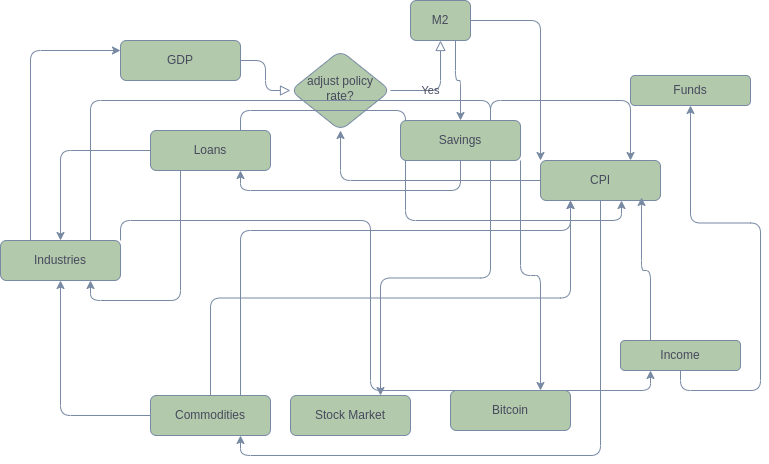

# Quanta Liquidi Index
Mapping liquidity level in global economy 

]

# Methodologies

- Finding the liquidity factors and combine data sources
- Combine all factors into a readable index  
- Update regularly on web page with co-related charts
- etc. 

# Data Sources
We will try to use public data as much as we can but unavoidably there will be some data we can't acquired easily or timely from some institutions. Also even we pay for some data, we still need to process them to be able to use in our system conveniently and structurally. 
