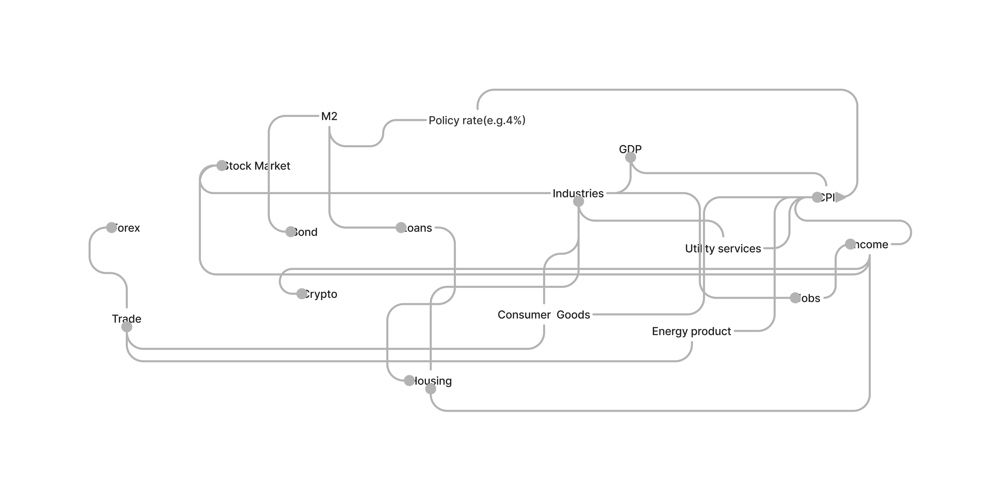

# Economy Map
code name "burray" to help us get more insightful about global economy

]

# Methodologies

- Wadley Map (https://miro.com/blog/wardley-maps-whiteboard-canvas/)
- Data Science (https://www.coursera.org/specializations/data-science-python)
- Monta Carlo Simulation (https://ocw.mit.edu/courses/6-0002-introduction-to-computational-thinking-and-data-science-fall-2016/resources/lecture-6-monte-carlo-simulation/)
- etc. 
# Data Sources
We will try to use public data as much as we can but unavoidably there will be some data we can't acquired easily or timely from some institutions. Also even we pay for some data, we still need to process them to be able to use in our system conveniently and structurally. 
