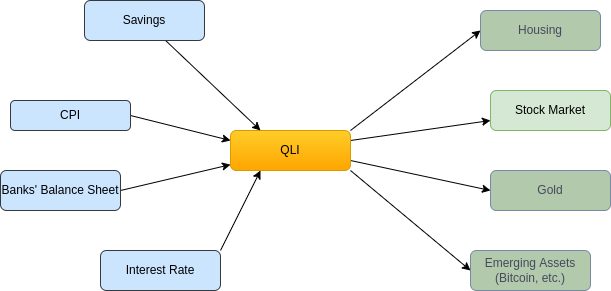

# Quanta Liquidity Index
Mapping liquidity level in global economy 

# On Liquidity and QLI
Liquidity is an important aspect of an economy because it affects the ability of individuals and businesses to access the funds they need to make purchases, invest in new projects, and grow their operations. When an economy has high liquidity, it means that there is a lot of money circulating within it, and it is easy for people and businesses to get their hands on the funds they need. This can help to drive economic growth and development, as it enables businesses to invest in new projects and expand their operations, and it also allows individuals to make purchases and consume goods and services.

There are many liquidity measurements in the market, but most of them are difficult to access or hidden behind paywalls. This is frustrating because ["Information wants to be free"](https://en.wikipedia.org/wiki/Information_wants_to_be_free). That's why we want to create a new public index called the Quantitative Liquidity Index (QLI). The QLI will be created by collecting open or derived data from known sources such as central banks, credit markets, interbank lending, and foreign exchanges. We will use this data to study liquidity and make the QLI more useful for a wider range of scenarios, such as programmable asset trading. Furthermore, since liquidity is closely related to money supply and other financial factors, we believe the QLI will be a valuable tool for studying and understanding these relationships.

# Methodologies

- Study the liquidity factors
- Design a formula towards a readable index
- Explore data sources
- Connect with web services 
- Update regularly on web page with co-related charts
- etc. 
